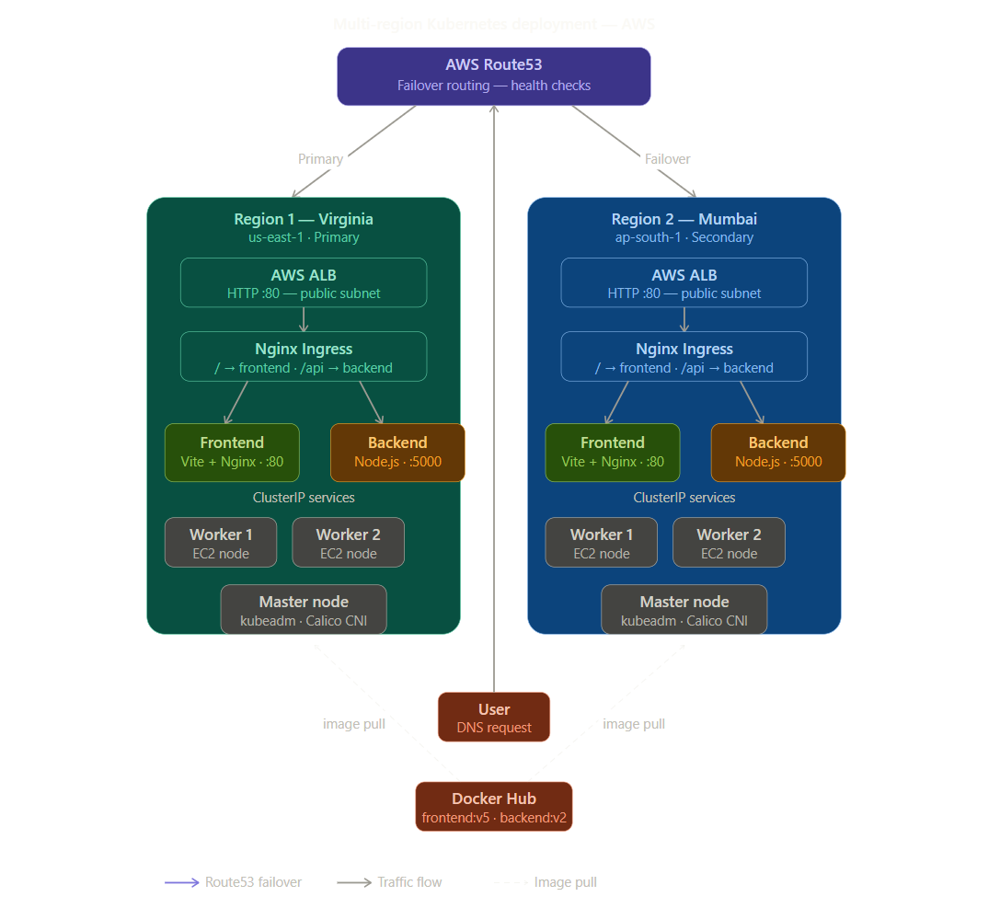
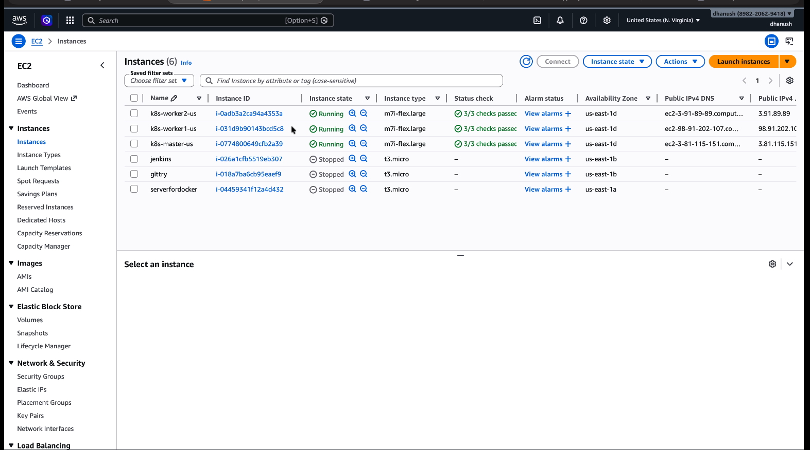
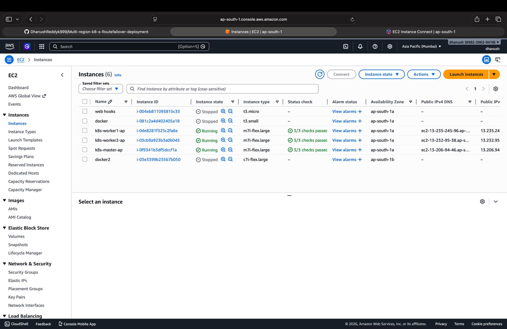
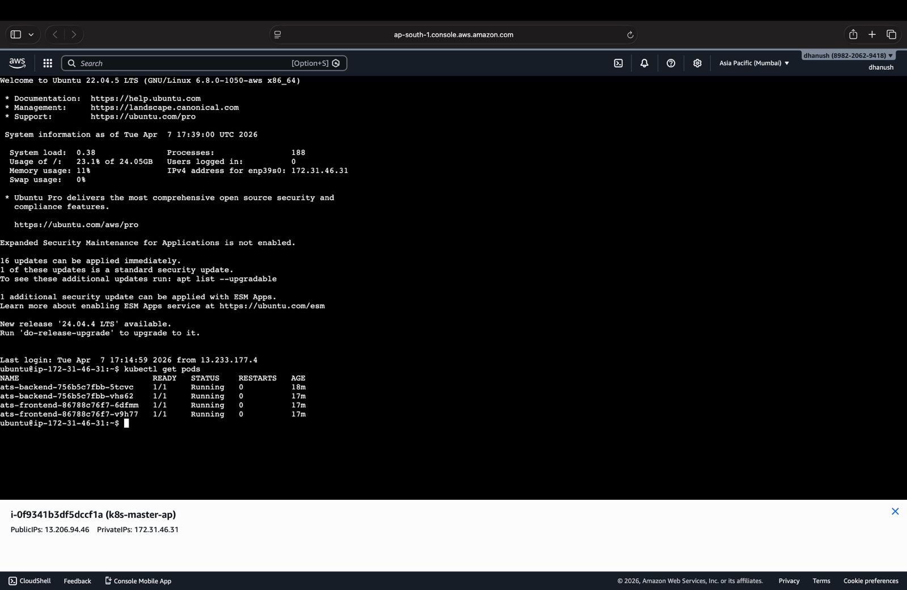
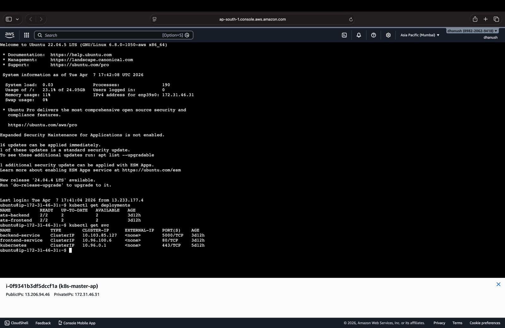
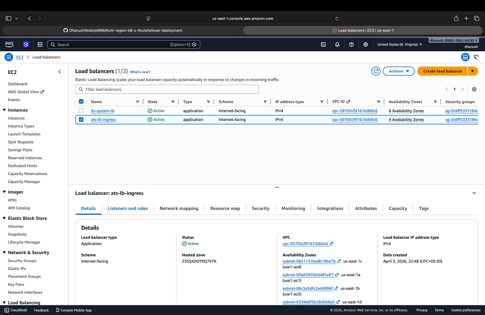
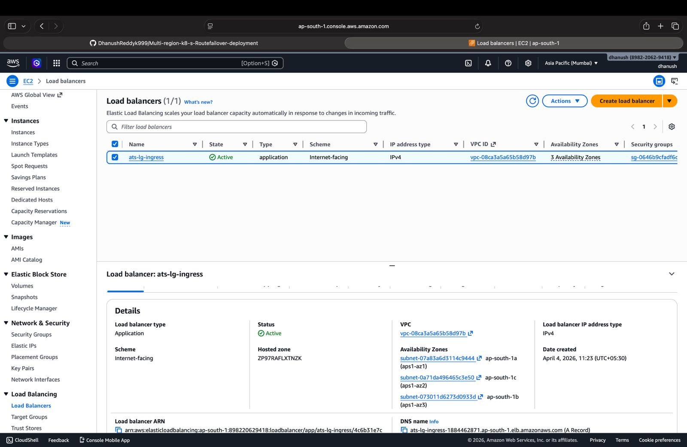
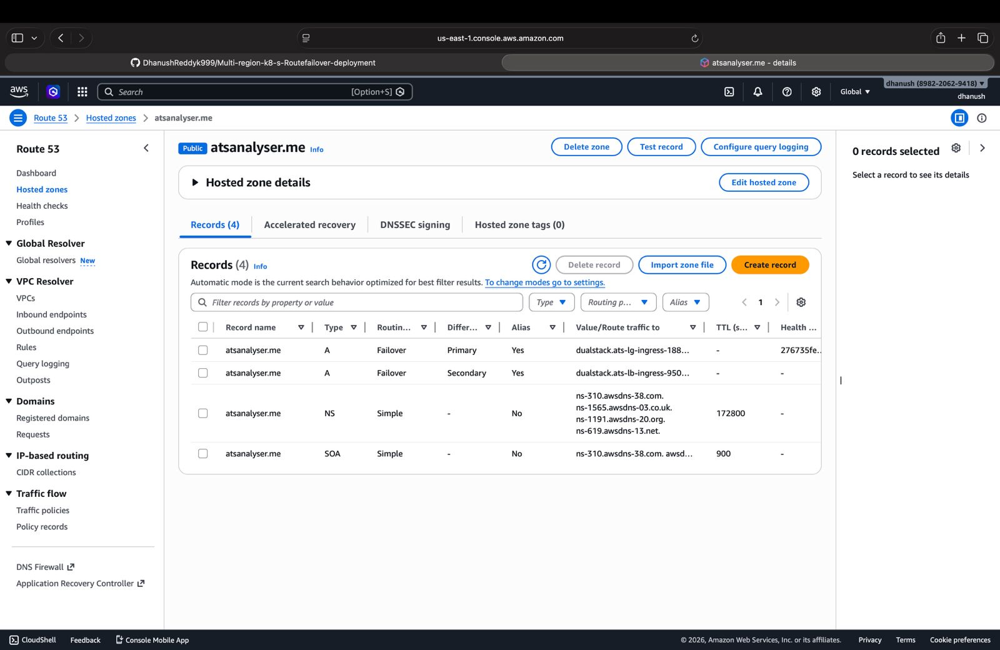
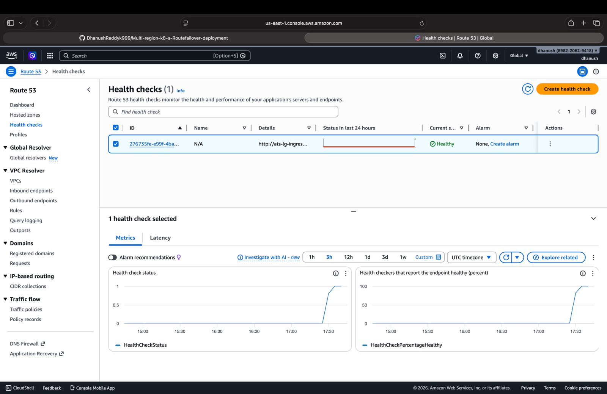

# Multi-Region-K8s-Deployment-on-AWS

A production-grade, highly available full-stack web application deployed across two AWS regions using Kubernetes, Docker, and AWS Route53 failover routing — ensuring zero downtime and automatic disaster recovery.

## Live Architecture

| Component | Region 1 | Region 2 |
|---|---|---|
| Location | Virginia (us-east-1) | Mumbai (ap-south-1) |
| Role | Primary | Secondary (Failover) |
| Nodes | 1 Master + 2 Workers | 1 Master + 2 Workers |
| Instance Type | m7i-flex.large | m7i-flex.large |
| Load Balancer | AWS ALB | AWS ALB |
| DNS | Route53 Failover | Route53 Failover |

---

## Architecture Overview

This project demonstrates the deployment of a full-stack web application across
two AWS regions — Virginia (us-east-1) as primary and Mumbai (ap-south-1) as
secondary — ensuring high availability and zero downtime. Each region runs a
Kubernetes cluster with 1 Master Node and 2 Worker Nodes, set up using kubeadm
on Ubuntu 22.04 EC2 instances. The application consists of a React (Vite)
frontend served via Nginx and a Node.js backend, both containerized using Docker
and deployed as Kubernetes workloads. Traffic within each cluster is managed
through Nginx Ingress and an AWS Application Load Balancer. At the global level,
AWS Route53 continuously monitors both regions using health checks and
automatically routes users to the healthy region — if the primary region fails,
traffic instantly fails over to Mumbai, and recovers back automatically when
Virginia comes online.

---

## 🛠️ Tech Stack

| Category | Technology |
|---|---|
| Container Orchestration | Kubernetes v1.29 (kubeadm) |
| Container Runtime | containerd |
| CNI Plugin | Calico v3.27 |
| Ingress Controller | Nginx Ingress |
| Containerization | Docker |
| Frontend | React (Vite) + Nginx |
| Backend | Node.js |
| Cloud Provider | AWS |
| Compute | EC2 (m7i-flex.large) |
| Load Balancer | AWS Application Load Balancer |
| DNS & Failover | AWS Route53 |
| OS | Ubuntu 22.04 LTS |

---

## ⚙️ Setup & Deployment Steps

### Step 1 — EC2 Infrastructure
- Created EC2 instances in both regions
- 1 Master + 2 Worker nodes per region
- Ubuntu 22.04 LTS on m7i-flex.large instances
- Configured security groups for SSH and internal VPC traffic

### Step 2 — Base Setup (All Nodes)
- Updated packages and installed dependencies
- Disabled swap (required by Kubernetes)
- Loaded kernel modules: overlay and br_netfilter

### Step 3 — Install containerd
- Installed containerd as the container runtime
- Configured SystemdCgroup = true for compatibility with Kubernetes

### Step 4 — Install Kubernetes
- Added Kubernetes v1.29 apt repository
- Installed kubeadm, kubelet, and kubectl
- Held package versions to prevent auto-upgrades

### Step 5 — Networking Setup
- Configured sysctl settings for bridge networking
- Enabled IP forwarding for pod-to-pod communication

### Step 6 — Initialize Cluster (Master Only)
- Ran kubeadm init with pod CIDR 192.168.0.0/16
- Used master private IP as API server advertise address

### Step 7 — Configure kubectl
- Copied admin kubeconfig to home directory
- Set correct file ownership for kubectl access

### Step 8 — Install Calico CNI
- Applied Calico v3.27 manifest for pod networking
- Enables pod IP assignment and inter-node routing

### Step 9 — Join Worker Nodes
- Used kubeadm join token and certificate hash
- Joined both worker nodes to the cluster in each region

### Step 10 — Build & Push Docker Images
- Built multi-stage frontend Dockerfile (Node build → Nginx serve)
- Built backend Dockerfile with Node.js 20
- Pushed both images to Docker Hub

### Step 11 — Deploy Application
- Applied frontend and backend Deployment manifests
- 2 replicas each for redundancy within the cluster
- Configured environment variables for backend

### Step 12 — Create Services
- Created ClusterIP services for frontend (port 80) and backend (port 5000)
- Services provide stable internal DNS for pod communication

### Step 13 — Install Nginx Ingress Controller
- Applied official Nginx Ingress Controller manifest
- Acts as reverse proxy inside the cluster

### Step 14 — Configure Ingress Rules
- / path routes to frontend service (port 80)
- /api path routes to backend service (port 5000)

### Step 15 — Setup AWS ALB
- Created Application Load Balancer in both regions
- Configured Target Groups pointing to NodePort
- Set health checks on / expecting 200–499 response

### Step 16 — Route53 Failover
- Created hosted zone and updated NS records
- Set up health checks for both region ALBs
- Created Primary (Virginia) and Secondary (Mumbai) failover DNS records
- Automatic failover triggers after 3 consecutive health check failures

---

## How Failover Works
User Request
│
▼
AWS Route53 (DNS)
│
├──── Health Check PASS ──── Virginia ALB ──── Nginx Ingress ──── Pods
│
└──── Health Check FAIL ──── Mumbai ALB ──── Nginx Ingress ──── Pods
(auto failover — no manual intervention required)
1. User's DNS request hits Route53
2. Route53 checks Virginia ALB health check
3. If healthy → traffic goes to Virginia
4. If unhealthy (3 failures) → Route53 automatically activates Mumbai
5. Traffic redirects to Mumbai with zero manual intervention
6. When Virginia recovers → traffic automatically fails back

---

## 📊 Capacity

| Instance | vCPU | RAM | Concurrent Users / Region |
|---|---|---|---|
| m7i-flex.large | 2 | 8 GB | 2,000 – 4,000 |

- Total workers per region: 2 nodes = 4 vCPU, 16 GB RAM
- Both regions combined (if active): up to ~8,000 concurrent users
- No CPU credit throttling — m7i-flex runs at 100% baseline always

---

## 📸 Screenshots

### Architecture

### Cluster Nodes — Virginia

### Cluster Nodes — Mumbai

### Pods Running

### Services

### Ingress

### ALB — Virginia (Healthy)

### ALB — Mumbai (Healthy)

### Route53 Records

### Route53 Health Checks

### Application Running in Browser

---

## Key Learnings

- Setting up a production-grade Kubernetes cluster from scratch using kubeadm
  teaches you every layer of the system that managed services like EKS abstract away
- Multi-region deployment is not just about redundancy — it is about designing
  every layer (compute, networking, DNS) to handle failure gracefully
- Route53 failover routing combined with ALB health checks creates a truly
  self-healing infrastructure that requires zero manual intervention during outages
- Containerizing applications with Docker and managing them through Kubernetes
  Deployments and Services is the foundation of modern cloud-native architecture

---

## Author

**Your Name**
- GitHub: [@srinivas-choudarapu](https://github.com/srinivas-choudarapu)
- Docker Hub: [chsrinivas55](https://hub.docker.com/u/chsrinivas55)

---

## 📄 License

This project is for educational purposes.

